# HealthcareWale — Complete System Architecture & Infrastructure Diagram

# Purpose

This document defines the complete technical architecture of HealthcareWale.

It includes:
- frontend architecture
- backend architecture
- AI orchestration
- WhatsApp integration
- pharmacy systems
- hospital systems
- distributor systems
- analytics infrastructure
- DevOps architecture
- security architecture
- deployment topology
- scalability design
- microservices
- event-driven workflows
- database architecture
- offline-first architecture
- healthcare compliance architecture

This document is intended for:
- founders
- backend engineers
- frontend engineers
- DevOps teams
- AI engineers
- investors
- solution architects

---

# 1. HIGH-LEVEL PLATFORM ARCHITECTURE

```mermaid
flowchart TB

subgraph Users
P[Patients]
C[Clinics]
PH[Pharmacies]
H[Hospitals]
D[Distributors]
A[Admins]
end

subgraph Frontend Layer
APP[Patient Android App]
WEB[Admin Web Panel]
PWA[PWA App]
DOC[Doctor Dashboard]
PHWEB[Pharmacy Dashboard]
end

subgraph API Gateway
GATEWAY[API Gateway]
AUTH[Authentication Service]
end

subgraph Core Services
APPT[Appointment Service]
INV[Inventory Service]
BILL[Billing Service]
QUEUE[Queue Management]
SUPPORT[Support Service]
NOTIFY[Notification Service]
AIORCH[AI Orchestration]
end

subgraph AI Layer
VOICE[Voice AI]
OCR[Prescription OCR]
LLM[LLM Layer]
LANG[Hindi/Bengali NLP]
end

subgraph Communication Layer
WA[WhatsApp API]
SMS[SMS Gateway]
CALL[Voice Call Provider]
EMAIL[Email Service]
end

subgraph Data Layer
POSTGRES[(PostgreSQL)]
REDIS[(Redis)]
S3[(Object Storage)]
WAREHOUSE[(Analytics Warehouse)]
end

Users --> Frontend Layer
Frontend Layer --> API Gateway
API Gateway --> Core Services
Core Services --> AI Layer
Core Services --> Communication Layer
Core Services --> Data Layer
```

---

# 2. MICRO SERVICES ARCHITECTURE

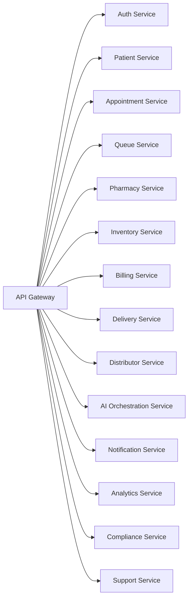

---

# 3. PATIENT APP ARCHITECTURE

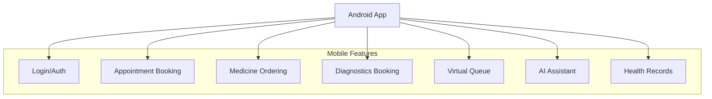

---

# 4. ADMIN WEB ARCHITECTURE

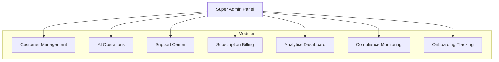

---

# 5. AI ORCHESTRATION ARCHITECTURE

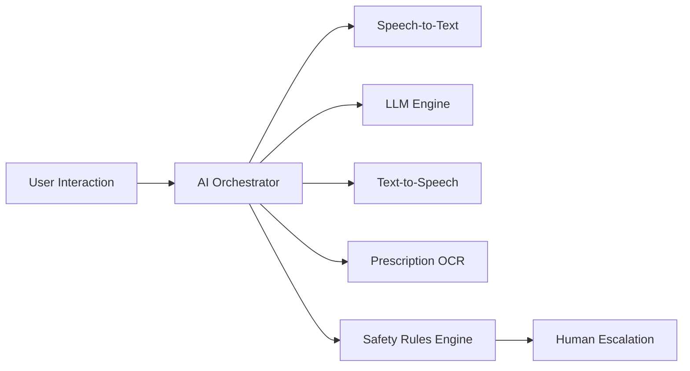

---

# 6. WHATSAPP AUTOMATION ARCHITECTURE

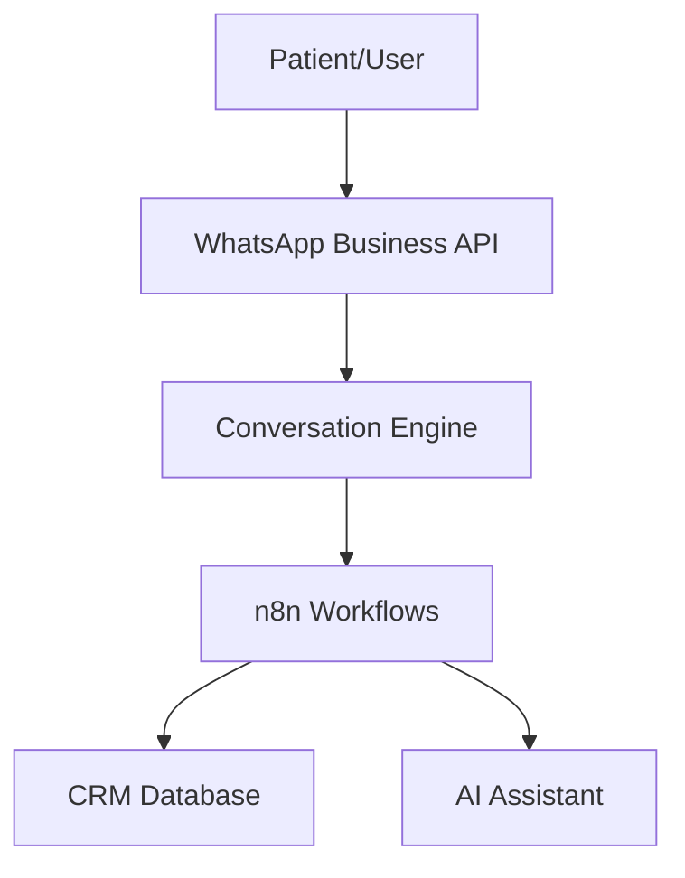

---

# 7. PHARMACY SYSTEM ARCHITECTURE

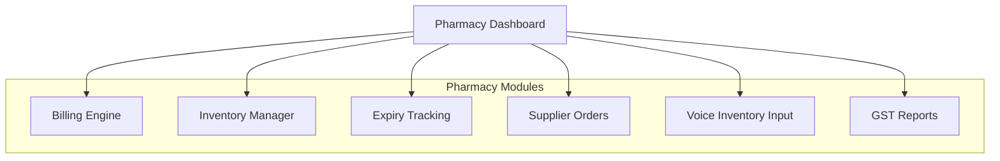

---

# 8. HOSPITAL HMS ARCHITECTURE

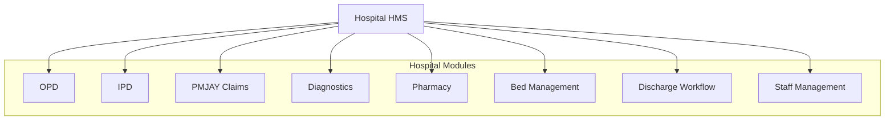

---

# 9. DATABASE ARCHITECTURE

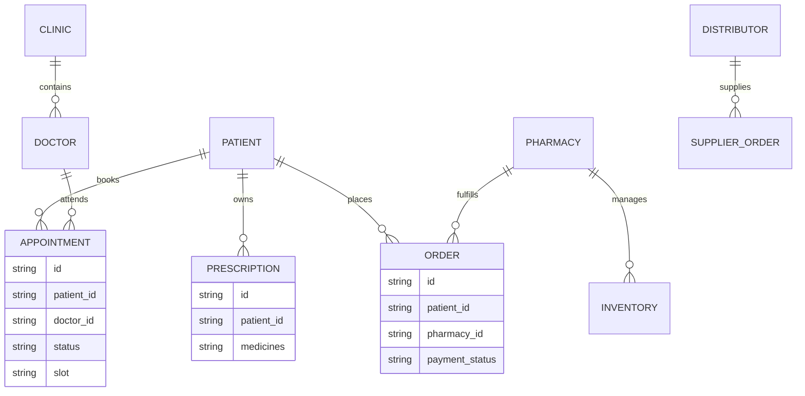

---

# 10. EVENT-DRIVEN WORKFLOW ARCHITECTURE

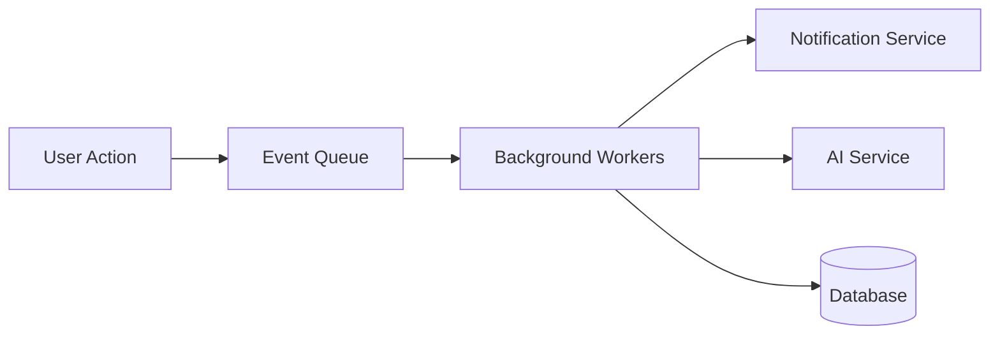

---

# 11. OFFLINE-FIRST ARCHITECTURE

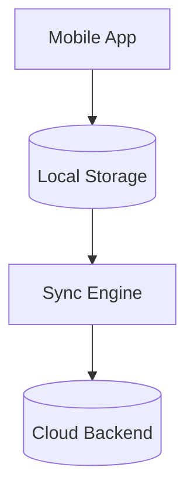

---

# 12. SECURITY ARCHITECTURE

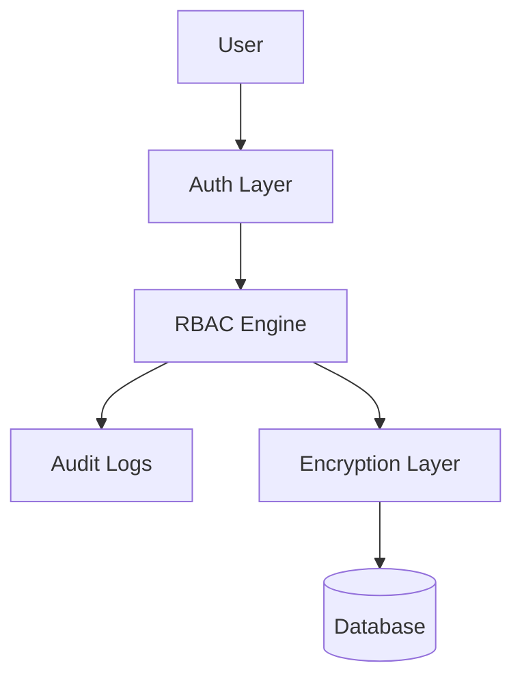

---

# 13. CLOUD INFRASTRUCTURE ARCHITECTURE

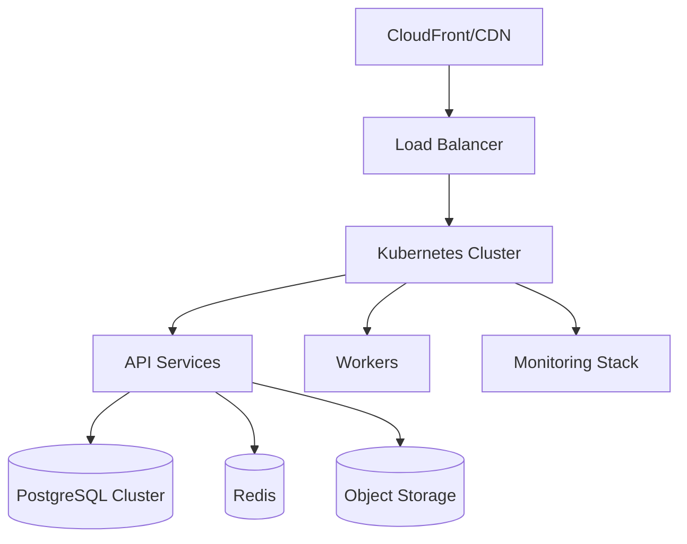

---

# 14. RECOMMENDED TECH STACK

## Frontend
- Next.js 14
- React Native
- Tailwind CSS
- shadcn/ui
- Zustand
- TanStack Query

---

## Backend
- Node.js
- NestJS
- PostgreSQL
- Redis
- Kafka/RabbitMQ

---

## AI Layer
- OpenAI
- Sarvam AI
- Vapi
- Retell AI
- Whisper
- Azure Speech

---

## Infrastructure
- AWS Mumbai
- Kubernetes
- Docker
- Terraform
- GitHub Actions

---

# 15. SCALABILITY DESIGN

## Horizontal Scaling

Scale independently:
- AI workers
- notification workers
- queue systems
- analytics pipelines

---

## Multi-Tenant Architecture

Each customer isolated logically:
- clinics
- pharmacies
- hospitals
- distributors

---

## High Availability

Need:
- multi-zone DB replication
- Redis replication
- autoscaling
- failover routing

---

# 16. COMPLIANCE ARCHITECTURE

## Required Compliance Layers

- DPDP Act
- audit logging
- consent management
- PHI encryption
- access monitoring
- data deletion workflows

---

# 17. ANALYTICS & DATA WAREHOUSE

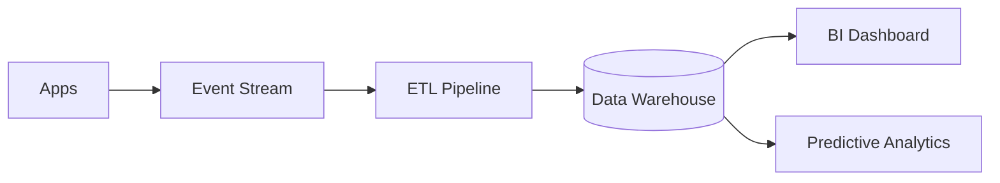

---

# 18. N8N AUTOMATION ARCHITECTURE

## Workflow Examples

- appointment reminders
- medicine refill reminders
- distributor reorder workflows
- WhatsApp escalations
- payment recovery
- onboarding automation

---

# 19. DEVOPS PIPELINE

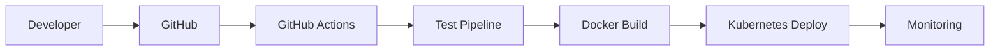

---

# 20. FINAL STRATEGIC INSIGHT

HealthcareWale is NOT just:
- a healthcare app
- a pharmacy ERP
- an HMS
- an AI assistant

It is:

# a healthcare operations infrastructure platform.

That means architecture must prioritize:
- operational reliability
- low latency
- multilingual AI
- offline-first workflows
- healthcare compliance
- workflow automation
- scalability
- supportability
- fault tolerance

The companies that survive Indian healthcare scale are not the companies with the fanciest UI.

They are the companies whose operations do not collapse under real-world stress.
