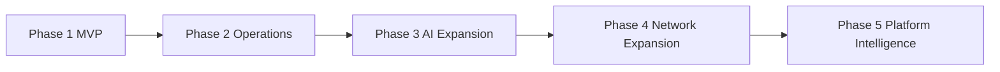
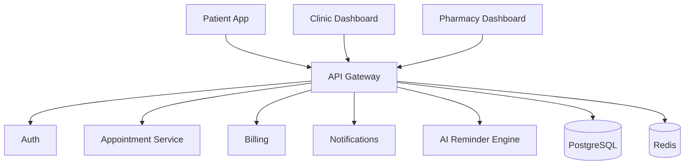
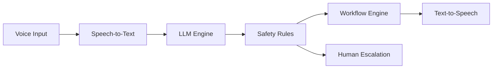
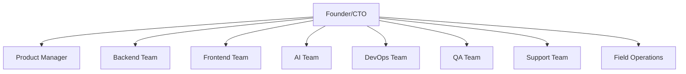
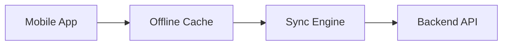
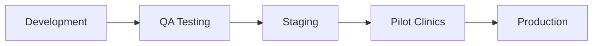

# HealthcareWale — Production Ready Development Strategy & Execution Diagram

# Purpose

This document defines the REAL production-ready development strategy for HealthcareWale.

Not startup-pitch strategy.

Not generic SaaS theory.

This is the actual execution architecture required to build a scalable healthcare operations platform for India.

This includes:
- product development roadmap
- engineering execution model
- infrastructure rollout
- AI deployment strategy
- scaling strategy
- release management
- DevOps lifecycle
- team structure
- QA workflows
- healthcare compliance execution
- rollout sequencing
- production deployment architecture
- support systems
- observability
- security operations
- AI governance
- disaster recovery
- operational scalability

---

# 1. MOST IMPORTANT STRATEGIC REALITY

HealthcareWale is NOT:
- a simple app
- a typical SaaS dashboard
- a pure AI company
- a normal marketplace

It is:

# an operational healthcare infrastructure platform.

That changes everything.

Because:
- uptime matters
- operational trust matters
- healthcare data matters
- low-tech usability matters
- multilingual support matters
- support operations matter
- offline reliability matters

Most healthtech startups fail because they underestimate operational complexity.

---

# 2. EXECUTION STRATEGY PRINCIPLE

# DO NOT BUILD EVERYTHING TOGETHER.

This is the biggest founder mistake.

If you attempt simultaneously:
- HMS
- pharmacy ERP
- AI voice platform
- telemedicine
- delivery logistics
- analytics
- diagnostics
- distributor SaaS

You will create:
- engineering chaos
- support chaos
- operational instability
- poor PMF
- cash burn explosion

---

# 3. RECOMMENDED DEVELOPMENT PHASES

---

# 4. PHASE 1 — MVP STRATEGY (0–6 MONTHS)

# Goal

Validate operational adoption.

NOT AI hype.

---

# Features Allowed in MVP

ONLY:
- appointment booking
- WhatsApp reminders
- AI reminder calls
- clinic dashboard
- pharmacy inventory lite
- billing
- patient app basics
- queue management
- basic analytics

---

# Features NOT Allowed in MVP

DO NOT build:
- full HMS
- PMJAY workflows
- distributor marketplace
- financing
- advanced AI analytics
- ambulance system
- enterprise BI
- insurance integrations

These will kill focus.

---

# MVP Architecture

---

# 5. PHASE 2 — OPERATIONS EXPANSION (6–12 MONTHS)

# Goal

Reduce operational chaos.

---

# Features Added

- advanced inventory
- supplier workflows
- WhatsApp CRM
- AI receptionist
- prescription OCR
- diagnostics booking
- chronic care reminders
- multi-clinic management

---

# Infrastructure Changes

Add:
- event queues
- worker services
- observability stack
- centralized logging
- object storage

---

# 6. PHASE 3 — AI EXPANSION (12–18 MONTHS)

# Goal

Operational AI automation.

NOT AI gimmicks.

---

# AI Features

- AI receptionist
- AI reorder calls
- AI support assistant
- AI scheduling assistant
- AI no-show prediction
- AI inventory forecasting

---

# AI Governance Mandatory

Need:
- human escalation
- hallucination controls
- safety filters
- audit logging
- confidence scoring

---

# AI ARCHITECTURE

---

# 7. PHASE 4 — NETWORK EXPANSION (18–30 MONTHS)

# Goal

Build network effects.

---

# Features

- distributor network
- diagnostics partnerships
- PMJAY integration
- ABDM integration
- pharmacy network
- logistics orchestration

---

# Strategic Outcome

This creates:
- workflow lock-in
- operational dependency
- supply-chain moat

---

# 8. PHASE 5 — PLATFORM INTELLIGENCE (30+ MONTHS)

# Goal

Become healthcare infrastructure layer.

---

# Features

- predictive analytics
- financing
- risk scoring
- operational intelligence
- benchmark analytics
- healthcare BI

---

# 9. PRODUCTION TEAM STRUCTURE

---

# 10. ENGINEERING TEAM BREAKDOWN

# Backend Team

Responsibilities:
- APIs
- auth
- billing
- inventory
- integrations
- event systems

---

# Frontend Team

Responsibilities:
- patient app
- admin web
- pharmacy dashboard
- responsive UI
- offline support

---

# AI Team

Responsibilities:
- AI orchestration
- Hindi/Bengali AI
- OCR
- voice systems
- AI monitoring

---

# DevOps Team

Responsibilities:
- Kubernetes
- CI/CD
- monitoring
- autoscaling
- backups
- observability

---

# QA Team

Responsibilities:
- regression testing
- workflow testing
- multilingual testing
- low-network testing
- healthcare edge-case testing

---

# 11. PRODUCTION INFRASTRUCTURE STRATEGY

# Recommended Cloud

Primary:
- AWS Mumbai

Optional Hybrid:
- AWS + Cloudflare

---

# Required Services

## Compute
- EKS/Kubernetes
- EC2 workers

## Database
- PostgreSQL cluster
- read replicas

## Cache
- Redis cluster

## Storage
- S3

## Messaging
- Kafka/RabbitMQ

## Monitoring
- Grafana
- Prometheus
- Loki
- Sentry

---

# 12. COMPLETE DEPLOYMENT ARCHITECTURE

```mermaid
flowchart TB

USERS[Users]
CDN[Cloudflare/CDN]
LB[Load Balancer]
K8S[Kubernetes Cluster]

API[API Pods]
WORKERS[Worker Pods]
AI[AI Services]

DB[(PostgreSQL)]
REDIS[(Redis)]
S3[(Object Storage)]
MONITOR[Monitoring Stack]

USERS --> CDN
CDN --> LB
LB --> K8S
K8S --> API
K8S --> WORKERS
K8S --> AI

API --> DB
API --> REDIS
API --> S3
K8S --> MONITOR
```

---

# 13. DATABASE STRATEGY

# Primary Database

Use PostgreSQL.

Reason:
- transactional reliability
- healthcare data integrity
- relational workflows
- analytics compatibility

---

# Redis Usage

Use for:
- queues
- caching
- sessions
- real-time queue tracking

---

# Analytics Warehouse

Use:
- ClickHouse
or
- BigQuery

For:
- reporting
- BI
- predictive analytics

---

# 14. API STRATEGY

# API Gateway

Responsibilities:
- auth
- rate limiting
- tenant isolation
- API analytics
- request validation

---

# API Standards

Use:
- REST primary
- GraphQL optional later
- OpenAPI specs mandatory

---

# 15. AUTHENTICATION STRATEGY

# User Auth

- OTP login
- JWT
- refresh tokens
- biometric optional

---

# Enterprise Auth

- RBAC
- tenant isolation
- audit logging
- device tracking

---

# 16. OFFLINE-FIRST STRATEGY

# Critical for India

Need:
- local caching
- sync engine
- retry queue
- offline billing
- offline token management

---

# Offline Architecture

---

# 17. WHATSAPP INFRASTRUCTURE STRATEGY

# WhatsApp Will Be Core Infrastructure

Not optional.

---

# WhatsApp Workflows

- reminders
- bookings
- support
- medicine orders
- queue updates
- reports
- payment reminders

---

# Recommended Providers

- Gupshup
- Twilio
- Interakt

---

# 18. AI COST OPTIMIZATION STRATEGY

# Critical Reality

AI voice can destroy margins.

---

# Required Controls

- confidence routing
- hybrid IVR
- short-call optimization
- fallback workflows
- caching
- low-confidence escalation

---

# 19. QA & TESTING STRATEGY

# Testing Types

## Functional Testing
- booking
- billing
- reminders
- inventory

## Stress Testing
- queue spikes
- WhatsApp floods
- AI load

## Real-World Testing
- low internet
- Hindi/Bengali flows
- low-end Android devices

---

# 20. OBSERVABILITY STRATEGY

# Need Full Monitoring

Monitor:
- API latency
- AI failures
- WhatsApp failures
- DB load
- queue lag
- failed notifications
- delivery failures

---

# Observability Stack

- Grafana
- Prometheus
- Loki
- OpenTelemetry
- Sentry

---

# 21. SECURITY STRATEGY

# Mandatory Security Layers

- PHI encryption
- audit logs
- RBAC
- API security
- WAF
- DDoS protection
- device tracking
- suspicious behavior alerts

---

# 22. COMPLIANCE STRATEGY

# Mandatory Compliance

- DPDP Act
- audit logs
- consent management
- deletion workflows
- healthcare data protection

---

# 23. RELEASE MANAGEMENT STRATEGY

# Release Pipeline

---

# 24. FIELD ROLLOUT STRATEGY

# Pilot Markets

Recommended:
- Durgapur
- Siliguri
- Lucknow outskirts
- Gorakhpur
- Asansol

---

# Rollout Sequence

1. clinics
2. pharmacies
3. diagnostics
4. distributors
5. hospitals

---

# 25. SUPPORT OPERATIONS STRATEGY

# Support Layers

## L1
Basic support

## L2
Technical workflows

## L3
Engineering

## L4
Critical incident response

---

# Support Channels

- WhatsApp
- AI chatbot
- phone support
- field support

---

# 26. MOST IMPORTANT PRODUCTION REALITY

Healthcare SaaS is NOT:
- pure software
- pure AI
- pure automation

It is:

# operational infrastructure.

That means:
- uptime matters more than fancy UI
- support matters more than animations
- onboarding matters more than features
- operational trust matters more than AI hype

---

# 27. FINAL STRATEGIC RECOMMENDATION

Build HealthcareWale like:
- Stripe for healthcare operations
NOT:
- another healthcare marketplace

Focus on:
- workflow reliability
- operational speed
- multilingual AI
- offline resilience
- supportability
- scalable infrastructure
- healthcare compliance
- field adoption

That is how you build a real healthcare infrastructure company in India.
