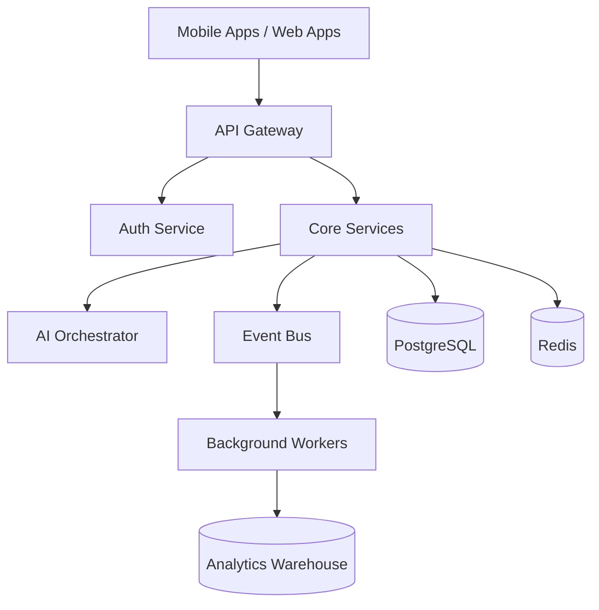
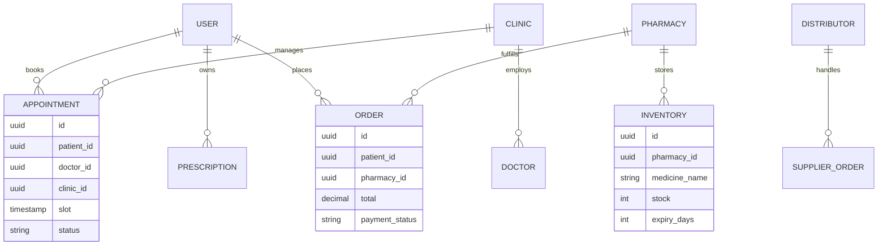
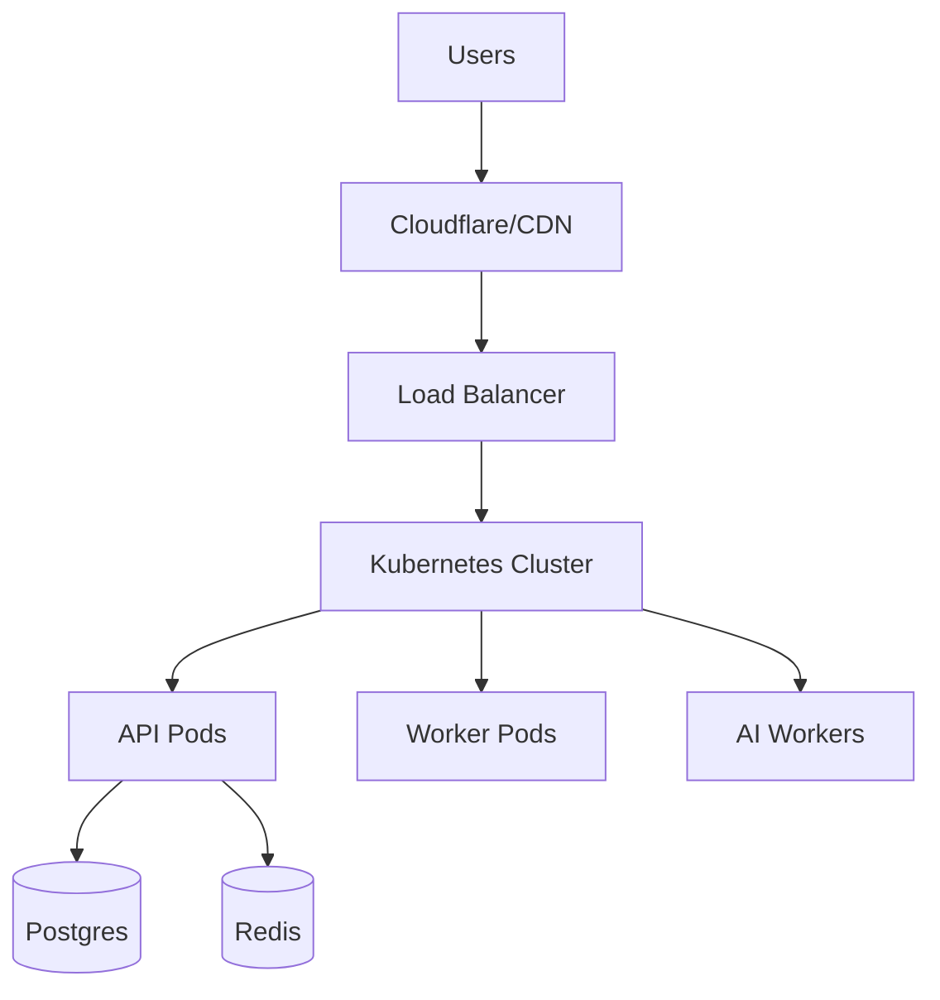
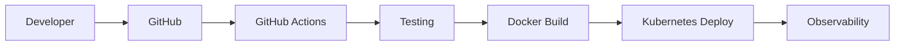

# HealthcareWale Enterprise Architecture Bible

# Version
v1.0 Production Architecture Draft

# Purpose

This document is the master engineering, infrastructure, operations, AI, and scalability blueprint for HealthcareWale.

This is NOT startup-pitch documentation.

This is a production-grade engineering architecture handbook intended for:
- backend engineers
- system architects
- DevOps engineers
- AI engineers
- platform engineers
- security teams
- investors doing technical diligence
- CTO-level planning

This document consolidates:
- FRD
- HLD
- LLD
- Infrastructure
- AI orchestration
- API strategy
- database architecture
- DevOps strategy
- security model
- observability
- compliance
- scalability
- operational workflows
- deployment strategy
- production-readiness analysis

---

# SECTION 1 — PLATFORM VISION

HealthcareWale is NOT:
- just a healthcare app
- just a pharmacy ERP
- just a clinic HMS
- just an AI assistant

HealthcareWale is:

# a healthcare operational infrastructure platform.

The core objective is to reduce operational chaos across:
- clinics
- pharmacies
- distributors
- hospitals
- diagnostics
- patient communication
- appointment management
- follow-up systems
- AI-assisted operations

---

# SECTION 2 — CORE PRODUCT DOMAINS

## Domain 1 — Patient Engagement

Includes:
- appointment booking
- virtual waiting room
- medicine ordering
- diagnostics booking
- AI reminders
- WhatsApp communication
- health records

---

## Domain 2 — Clinic Operations

Includes:
- receptionist workflows
- token management
- follow-ups
- billing
- prescriptions
- AI receptionist

---

## Domain 3 — Pharmacy Operations

Includes:
- inventory management
- expiry tracking
- billing
- distributor ordering
- voice inventory updates
- OCR prescription processing

---

## Domain 4 — Distributor Operations

Includes:
- retailer management
- automated order collection
- AI reorder workflows
- route planning
- territory analytics

---

## Domain 5 — Platform Intelligence

Includes:
- analytics
- AI orchestration
- workflow automation
- predictive insights
- operational scoring

---

# SECTION 3 — FUNCTIONAL REQUIREMENTS DOCUMENT (FRD)

# 3.1 PATIENT APPOINTMENT WORKFLOW

## Workflow Sequence

1. Patient opens app or WhatsApp.
2. Patient searches doctor/clinic.
3. Backend queries appointment service.
4. Available slots fetched.
5. Queue engine calculates estimated wait.
6. Booking created.
7. Notification workflows triggered.
8. WhatsApp confirmation sent.
9. AI reminder schedule created.
10. Queue token generated.

---

## Failure Handling

If:
- doctor unavailable
- slot conflict
- network timeout

Then:
- retry queue triggered
- alternate slot recommendation shown
- notification retried

---

# 3.2 AI REMINDER WORKFLOW

## Trigger Types

- upcoming appointment
- missed appointment
- medicine refill due
- follow-up overdue

---

## AI Workflow

1. Scheduler scans due reminders.
2. Event pushed to worker queue.
3. AI orchestration selects channel.
4. WhatsApp/SMS/Voice call triggered.
5. Delivery status logged.
6. Escalation triggered on failure.

---

# 3.3 PRESCRIPTION OCR WORKFLOW

## Flow

1. Patient uploads prescription.
2. OCR service extracts text.
3. Medicine parser normalizes names.
4. Human pharmacist verification triggered.
5. Approved medicines added to cart.

---

## Risks

- handwriting ambiguity
- dosage extraction failure
- unsafe medicine mapping

Human verification mandatory.

---

# 3.4 PHARMACY INVENTORY FLOW

## Inventory Update Sources

- distributor sync
- manual update
- CSV import
- voice inventory input

---

## Expiry Management

Scheduler scans:
- near-expiry medicines
- dead inventory
- low stock items

AI suggests:
- reorder
- discounting
- distributor return

---

# SECTION 4 — RBAC MATRIX

| Role | Access |
|---|---|
| Patient | appointments, orders, records |
| Doctor | prescriptions, appointments |
| Receptionist | queue, booking, billing |
| Pharmacy Staff | billing, inventory |
| Pharmacy Admin | inventory, suppliers, reports |
| Hospital Admin | departments, claims, staff |
| Distributor | retailer orders, deliveries |
| Super Admin | platform-wide control |
| Support Agent | limited support access |

---

# SECTION 5 — HIGH LEVEL DESIGN (HLD)

# 5.1 ARCHITECTURAL STYLE

Recommended architecture:

# modular monolith evolving into event-driven microservices.

Reason:
- early-stage operational simplicity
- lower DevOps complexity
- easier onboarding
- easier debugging
- reduced infra cost

Microservices should only split after:
- stable PMF
- high operational load
- scaling bottlenecks

---

# 5.2 SYSTEM COMPONENTS



---

# SECTION 6 — LOW LEVEL DESIGN (LLD)

# 6.1 AUTH FLOW

## Login Process

1. User enters mobile number.
2. OTP generated.
3. OTP verified.
4. JWT issued.
5. Refresh token stored.
6. Device session registered.

---

## Security Layers

- JWT expiration
- refresh-token rotation
- device tracking
- suspicious login alerts
- IP anomaly detection

---

# 6.2 APPOINTMENT API CONTRACT

## Endpoint

POST /api/v1/appointments

---

## Request

```json
{
  "patientId": "uuid",
  "doctorId": "uuid",
  "clinicId": "uuid",
  "slot": "2026-05-27T10:30:00Z",
  "consultationType": "offline"
}
```

---

## Response

```json
{
  "success": true,
  "appointmentId": "uuid",
  "token": 14,
  "estimatedWait": 25
}
```

---

## Validation Rules

- doctor availability required
- clinic active required
- slot conflict prevention
- rate limiting

---

# 6.3 INVENTORY SERVICE LOGIC

## Core Logic

Inventory service handles:
- stock mutation
- expiry tracking
- reorder calculations
- supplier synchronization

---

## Important Rule

All stock updates must be transactional.

Never allow partial inventory writes.

---

# 6.4 QUEUE ENGINE

## Queue Generation Logic

Priority order:
1. emergency
2. senior citizen
3. appointment
4. walk-in

---

## Real-Time Queue Updates

Use:
- WebSockets
- Redis Pub/Sub

---

# SECTION 7 — DATABASE ARCHITECTURE



---

# DATABASE OPTIMIZATION STRATEGY

## Required Indexes

- appointment(slot, doctor_id)
- inventory(pharmacy_id, medicine_name)
- order(patient_id)
- notifications(status, created_at)

---

## Partitioning Strategy

Partition:
- audit logs
- notifications
- AI interactions
- analytics events

---

# SECTION 8 — INFRASTRUCTURE STRATEGY

# 8.1 CLOUD ARCHITECTURE

Primary cloud:
- AWS Mumbai

Core infrastructure:
- EKS
- RDS PostgreSQL
- Redis cluster
- S3
- CloudFront
- Kafka/RabbitMQ

---

# 8.2 DEPLOYMENT TOPOLOGY



---

# SECTION 9 — OBSERVABILITY

## Monitoring Stack

Use:
- Prometheus
- Grafana
- Loki
- Sentry
- OpenTelemetry

---

## Metrics To Track

- API latency
- AI failure rate
- WhatsApp delivery rate
- queue lag
- DB load
- Redis memory
- worker retry count

---

# SECTION 10 — SECURITY ARCHITECTURE

# Mandatory Security Layers

- RBAC
- PHI encryption
- TLS everywhere
- audit logging
- API rate limiting
- WAF
- DDoS protection
- suspicious behavior detection

---

# 10.1 RATE LIMITING

## Public APIs

- OTP APIs
- login APIs
- booking APIs

Must have:
- IP rate limiting
- device throttling
- bot protection

---

# SECTION 11 — COMPLIANCE

# Required Compliance Layers

- DPDP Act
- healthcare consent management
- audit trails
- data retention policies
- deletion workflows

---

# SECTION 12 — DEVOPS STRATEGY

# CI/CD Pipeline



---

# SECTION 13 — PRODUCTION RISKS

# Biggest Risks

## Operational Risk

System fragmentation.

---

## AI Risk

High voice AI cost.

---

## Scaling Risk

WhatsApp dependency.

---

## Product Risk

Trying to build too many modules simultaneously.

---

# SECTION 14 — WHAT SHOULD BE BUILT FIRST

# Recommended Priority

1. appointment workflows
2. WhatsApp automation
3. queue engine
4. pharmacy inventory lite
5. AI reminders
6. billing
7. analytics

Everything else later.

---

# SECTION 15 — FINAL CTO-LEVEL INSIGHT

HealthcareWale will NOT win because of:
- AI hype
- fancy dashboards
- generic telemedicine

It will win if it becomes:

# the operational workflow infrastructure layer for Indian healthcare businesses.

That means:
- operational reliability
- multilingual workflows
- low-bandwidth performance
- supportability
- onboarding simplicity
- automation depth
- workflow consistency

matter more than almost everything else.
